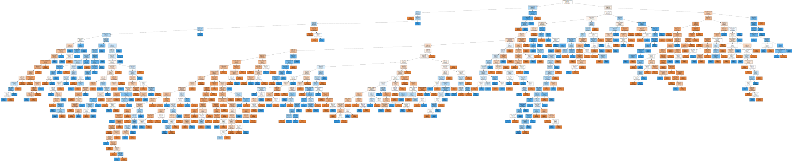
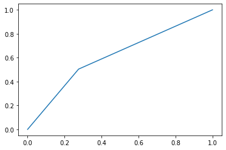

# Árbol de decisión para encuesta Reddit Chile

## Conexión a fuente de datos


```python
import numpy as np
import pandas as pd
```


```python
df = pd.read_pickle("df_encuesta.pkl")
```


```python
df.info()
```

    <class 'pandas.core.frame.DataFrame'>
    Int64Index: 1171 entries, 0 to 1181
    Data columns (total 47 columns):
     #   Column                     Non-Null Count  Dtype
    ---  ------                     --------------  -----
     0   edad                       1171 non-null   int32
     1   religion                   1171 non-null   int8 
     2   sexo_Hombre                1171 non-null   uint8
     3   sexo_Mujer                 1171 non-null   uint8
     4   orientacion_Bisexual       1171 non-null   uint8
     5   orientacion_Heterosexual   1171 non-null   uint8
     6   orientacion_Homosexual     1171 non-null   uint8
     7   ocupacion_Estudio          1171 non-null   uint8
     8   ocupacion_Ninguna          1171 non-null   uint8
     9   ocupacion_Trabajo          1171 non-null   uint8
     10  ocupacion_Trabajo;Estudio  1171 non-null   uint8
     11  region_I                   1171 non-null   uint8
     12  region_II                  1171 non-null   uint8
     13  region_III                 1171 non-null   uint8
     14  region_IV                  1171 non-null   uint8
     15  region_IX                  1171 non-null   uint8
     16  region_RM                  1171 non-null   uint8
     17  region_V                   1171 non-null   uint8
     18  region_VI                  1171 non-null   uint8
     19  region_VII                 1171 non-null   uint8
     20  region_VIII                1171 non-null   uint8
     21  region_X                   1171 non-null   uint8
     22  region_XI                  1171 non-null   uint8
     23  region_XII                 1171 non-null   uint8
     24  region_XIV                 1171 non-null   uint8
     25  region_XV                  1171 non-null   uint8
     26  region_XVI                 1171 non-null   uint8
     27  educacion_media            1171 non-null   uint8
     28  educacion_posgrado         1171 non-null   uint8
     29  educacion_superior         1171 non-null   uint8
     30  politica_izquierda         1171 non-null   uint8
     31  musica_Metal               1171 non-null   uint8
     32  musica_Pop                 1171 non-null   uint8
     33  musica_Rap                 1171 non-null   uint8
     34  musica_Rock                1171 non-null   uint8
     35  deporte_1hora              1171 non-null   uint8
     36  deporte_2horas             1171 non-null   uint8
     37  deporte_4horas             1171 non-null   uint8
     38  perro_agua                 1171 non-null   uint8
     39  perro_atom_humber          1171 non-null   uint8
     40  perro_bus                  1171 non-null   uint8
     41  perro_chilaquil            1171 non-null   uint8
     42  perro_ladron               1171 non-null   uint8
     43  perro_lipigas              1171 non-null   uint8
     44  perro_matapacos            1171 non-null   uint8
     45  perro_washington           1171 non-null   uint8
     46  perro_waton                1171 non-null   uint8
    dtypes: int32(1), int8(1), uint8(45)
    memory usage: 66.3 KB
    

# Selección de variables predictoras y de respuesta.


```python
X = df.loc[:, ~df.columns.isin(['politica_izquierda'])]
y = df['politica_izquierda']
```

# Generación data de entrenamiento y testeo más balanceo


```python
#creemos ahora muestras de entrenamiento y prueba seleccionadas aleatoriamente:
from sklearn.model_selection import train_test_split

X_train, X_test, y_train, y_test = train_test_split(X, y, test_size=0.20, 
                                                    random_state = 42)
```


```python
# balaceo con sobremuestro
y_train_Q = y_train[y_train == 1]
y_train_NQ = y_train[y_train == 0]
y_train_Q = y_train_Q.sample(len(y_train_NQ), replace = True, random_state = 42)
y_train = pd.concat([y_train_Q, y_train_NQ], axis=0)
y_train.value_counts()
X_train = X_train.loc[y_train.index,:]

del [y_train_Q, y_train_NQ]
```


```python
from sklearn.model_selection import GridSearchCV
from sklearn.tree import DecisionTreeClassifier

param_grid = {'max_features': ['auto', 'sqrt', 'log2'],
              'ccp_alpha': [0.1, .01, .001],
              'max_depth' : [3, 4, 5, 10, None],
              'criterion' :['gini', 'entropy'],
              'min_samples_split' : [2, 5, 10, 20],
              'min_samples_leaf' : [1, 2, 3, 5]
             }
tree_clas = DecisionTreeClassifier(random_state=42)
grid_search = GridSearchCV(estimator=tree_clas, param_grid=param_grid, cv=10, 
                           verbose=True, n_jobs = 2)
grid_search.fit(X_train, y_train)
```

    Fitting 10 folds for each of 1440 candidates, totalling 14400 fits
    


    GridSearchCV(cv=10, estimator=DecisionTreeClassifier(random_state=42), n_jobs=2,
                 param_grid={'ccp_alpha': [0.1, 0.01, 0.001],
                             'criterion': ['gini', 'entropy'],
                             'max_depth': [3, 4, 5, 10, None],
                             'max_features': ['auto', 'sqrt', 'log2'],
                             'min_samples_leaf': [1, 2, 3, 5],
                             'min_samples_split': [2, 5, 10, 20]},
                 verbose=True)


```python
modelo = grid_search.best_estimator_
modelo
```


    DecisionTreeClassifier(ccp_alpha=0.001, criterion='entropy',
                           max_features='log2', random_state=42)


# Ajuste y Gráfico árbol de decisión


```python
from sklearn import tree
from graphviz import Source
from IPython.display import SVG

# Separamos en X e Y:
modelo.fit(X_train, y_train)

# Graficamos árbol:
tree.export_graphviz(modelo, out_file='tree_balanced.dot')
graph = Source(tree.export_graphviz(modelo, out_file=None, feature_names = X_train.columns, 
                                    class_names=['No-Izquierda', 'Izquierda'], filled = True))
display(SVG(graph.pipe(format='svg')))
#https://github.com/conda-forge/graphviz-feedstock/issues/43
```


    

    


# Resultados modelo

## Matrices de confusión


```python
y_pred_train = modelo.predict(X_train)
y_pred_train = pd.DataFrame(y_pred_train, columns=["Y_predicha"],index = y_train.index)

from sklearn.metrics import classification_report
print("Resultado en Muestra de Entrenamiento:")

print(classification_report(y_train, y_pred_train))
```

    Resultado en Muestra de Entrenamiento:
                  precision    recall  f1-score   support
    
               0       1.00      1.00      1.00       421
               1       1.00      1.00      1.00       421
    
        accuracy                           1.00       842
       macro avg       1.00      1.00      1.00       842
    weighted avg       1.00      1.00      1.00       842
    
    


```python
y_pred_test = modelo.predict(X_test)
y_pred_test = pd.DataFrame(y_pred_test, columns=["Y_predicha"],index = y_test.index)

print("Resultado en Muestra de Prueba:")

print(classification_report(y_test, y_pred_test))
```

    Resultado en Muestra de Prueba:
                  precision    recall  f1-score   support
    
               0       0.59      0.72      0.65       116
               1       0.65      0.50      0.57       119
    
        accuracy                           0.61       235
       macro avg       0.62      0.61      0.61       235
    weighted avg       0.62      0.61      0.61       235
    
    

**Precision**: Cada vez que el modelo determina que un usuario de Reddit es de izquierda, acertará un 65% de las veces.  
**Recall**: El modelo es capaz de identificar al 50% de las personas que son efectivamente de izquierda.  
**Accuracy**: El modelo acierta un 61% de las veces.

## Curva ROC


```python
from sklearn import metrics
import matplotlib.pyplot as plt

roc = metrics.roc_curve(y_test, y_pred_test)
plt.plot(roc[0], roc[1])
```


    [<matplotlib.lines.Line2D at 0x1d9030b3cd0>]


    

    


## Variance Importance Factor


```python
vil = pd.DataFrame(list(zip(X.columns,modelo.feature_importances_)),
                   columns=['feature','mean_entropy_decrease']
                  ).sort_values(by='mean_entropy_decrease', ascending=False)
vil.head()
```


<div>
<style scoped>
    .dataframe tbody tr th:only-of-type {
        vertical-align: middle;
    }

    .dataframe tbody tr th {
        vertical-align: top;
    }

    .dataframe thead th {
        text-align: right;
    }
</style>
<table border="1" class="dataframe">
  <thead>
    <tr style="text-align: right;">
      <th></th>
      <th>feature</th>
      <th>mean_entropy_decrease</th>
    </tr>
  </thead>
  <tbody>
    <tr>
      <th>0</th>
      <td>edad</td>
      <td>0.254415</td>
    </tr>
    <tr>
      <th>43</th>
      <td>perro_matapacos</td>
      <td>0.065288</td>
    </tr>
    <tr>
      <th>1</th>
      <td>religion</td>
      <td>0.052418</td>
    </tr>
    <tr>
      <th>33</th>
      <td>musica_Rock</td>
      <td>0.042257</td>
    </tr>
    <tr>
      <th>31</th>
      <td>musica_Pop</td>
      <td>0.037932</td>
    </tr>
  </tbody>
</table>
</div>


