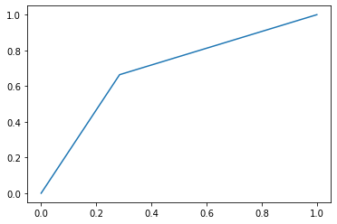

# Conexión a fuente de datos


```python
import numpy as np
import pandas as pd
```


```python
df = pd.read_pickle("df_encuesta.pkl")
```


```python
df.info()
```

    <class 'pandas.core.frame.DataFrame'>
    Int64Index: 1171 entries, 0 to 1181
    Data columns (total 47 columns):
     #   Column                     Non-Null Count  Dtype
    ---  ------                     --------------  -----
     0   edad                       1171 non-null   int32
     1   religion                   1171 non-null   int8 
     2   sexo_Hombre                1171 non-null   uint8
     3   sexo_Mujer                 1171 non-null   uint8
     4   orientacion_Bisexual       1171 non-null   uint8
     5   orientacion_Heterosexual   1171 non-null   uint8
     6   orientacion_Homosexual     1171 non-null   uint8
     7   ocupacion_Estudio          1171 non-null   uint8
     8   ocupacion_Ninguna          1171 non-null   uint8
     9   ocupacion_Trabajo          1171 non-null   uint8
     10  ocupacion_Trabajo;Estudio  1171 non-null   uint8
     11  region_I                   1171 non-null   uint8
     12  region_II                  1171 non-null   uint8
     13  region_III                 1171 non-null   uint8
     14  region_IV                  1171 non-null   uint8
     15  region_IX                  1171 non-null   uint8
     16  region_RM                  1171 non-null   uint8
     17  region_V                   1171 non-null   uint8
     18  region_VI                  1171 non-null   uint8
     19  region_VII                 1171 non-null   uint8
     20  region_VIII                1171 non-null   uint8
     21  region_X                   1171 non-null   uint8
     22  region_XI                  1171 non-null   uint8
     23  region_XII                 1171 non-null   uint8
     24  region_XIV                 1171 non-null   uint8
     25  region_XV                  1171 non-null   uint8
     26  region_XVI                 1171 non-null   uint8
     27  educacion_media            1171 non-null   uint8
     28  educacion_posgrado         1171 non-null   uint8
     29  educacion_superior         1171 non-null   uint8
     30  politica_izquierda         1171 non-null   uint8
     31  musica_Metal               1171 non-null   uint8
     32  musica_Pop                 1171 non-null   uint8
     33  musica_Rap                 1171 non-null   uint8
     34  musica_Rock                1171 non-null   uint8
     35  deporte_1hora              1171 non-null   uint8
     36  deporte_2horas             1171 non-null   uint8
     37  deporte_4horas             1171 non-null   uint8
     38  perro_agua                 1171 non-null   uint8
     39  perro_atom_humber          1171 non-null   uint8
     40  perro_bus                  1171 non-null   uint8
     41  perro_chilaquil            1171 non-null   uint8
     42  perro_ladron               1171 non-null   uint8
     43  perro_lipigas              1171 non-null   uint8
     44  perro_matapacos            1171 non-null   uint8
     45  perro_washington           1171 non-null   uint8
     46  perro_waton                1171 non-null   uint8
    dtypes: int32(1), int8(1), uint8(45)
    memory usage: 66.3 KB
    


```python
df.head()
```


<div>
<style scoped>
    .dataframe tbody tr th:only-of-type {
        vertical-align: middle;
    }

    .dataframe tbody tr th {
        vertical-align: top;
    }

    .dataframe thead th {
        text-align: right;
    }
</style>
<table border="1" class="dataframe">
  <thead>
    <tr style="text-align: right;">
      <th></th>
      <th>edad</th>
      <th>religion</th>
      <th>sexo_Hombre</th>
      <th>sexo_Mujer</th>
      <th>orientacion_Bisexual</th>
      <th>orientacion_Heterosexual</th>
      <th>orientacion_Homosexual</th>
      <th>ocupacion_Estudio</th>
      <th>ocupacion_Ninguna</th>
      <th>ocupacion_Trabajo</th>
      <th>...</th>
      <th>deporte_4horas</th>
      <th>perro_agua</th>
      <th>perro_atom_humber</th>
      <th>perro_bus</th>
      <th>perro_chilaquil</th>
      <th>perro_ladron</th>
      <th>perro_lipigas</th>
      <th>perro_matapacos</th>
      <th>perro_washington</th>
      <th>perro_waton</th>
    </tr>
  </thead>
  <tbody>
    <tr>
      <th>0</th>
      <td>27</td>
      <td>0</td>
      <td>1</td>
      <td>0</td>
      <td>1</td>
      <td>0</td>
      <td>0</td>
      <td>0</td>
      <td>0</td>
      <td>1</td>
      <td>...</td>
      <td>0</td>
      <td>0</td>
      <td>0</td>
      <td>0</td>
      <td>0</td>
      <td>1</td>
      <td>0</td>
      <td>0</td>
      <td>0</td>
      <td>0</td>
    </tr>
    <tr>
      <th>1</th>
      <td>30</td>
      <td>0</td>
      <td>1</td>
      <td>0</td>
      <td>0</td>
      <td>1</td>
      <td>0</td>
      <td>0</td>
      <td>0</td>
      <td>1</td>
      <td>...</td>
      <td>0</td>
      <td>0</td>
      <td>0</td>
      <td>0</td>
      <td>0</td>
      <td>1</td>
      <td>0</td>
      <td>0</td>
      <td>0</td>
      <td>0</td>
    </tr>
    <tr>
      <th>2</th>
      <td>26</td>
      <td>0</td>
      <td>1</td>
      <td>0</td>
      <td>0</td>
      <td>1</td>
      <td>0</td>
      <td>0</td>
      <td>0</td>
      <td>1</td>
      <td>...</td>
      <td>0</td>
      <td>0</td>
      <td>0</td>
      <td>0</td>
      <td>0</td>
      <td>1</td>
      <td>0</td>
      <td>0</td>
      <td>0</td>
      <td>0</td>
    </tr>
    <tr>
      <th>3</th>
      <td>18</td>
      <td>1</td>
      <td>1</td>
      <td>0</td>
      <td>0</td>
      <td>1</td>
      <td>0</td>
      <td>1</td>
      <td>0</td>
      <td>0</td>
      <td>...</td>
      <td>1</td>
      <td>0</td>
      <td>0</td>
      <td>0</td>
      <td>0</td>
      <td>1</td>
      <td>0</td>
      <td>0</td>
      <td>0</td>
      <td>0</td>
    </tr>
    <tr>
      <th>4</th>
      <td>19</td>
      <td>0</td>
      <td>1</td>
      <td>0</td>
      <td>0</td>
      <td>1</td>
      <td>0</td>
      <td>1</td>
      <td>0</td>
      <td>0</td>
      <td>...</td>
      <td>0</td>
      <td>0</td>
      <td>0</td>
      <td>0</td>
      <td>0</td>
      <td>0</td>
      <td>0</td>
      <td>0</td>
      <td>0</td>
      <td>1</td>
    </tr>
  </tbody>
</table>
<p>5 rows × 47 columns</p>
</div>


# Selección de variables predictoras y de respuesta.


```python
X = df.loc[:, ~df.columns.isin(['politica_izquierda'])]
y = df['politica_izquierda']
```

# Generación data de entrenamiento y testeo más balanceo


```python
from sklearn.model_selection import train_test_split

X_train, X_test, y_train, y_test = train_test_split(X, y, test_size=0.20, 
                                                    random_state = 42)
```


```python
# balaceo con sobremuestro
y_train_Q = y_train[y_train==1]
y_train_NQ = y_train[y_train==0]
y_train_Q = y_train_Q.sample(len(y_train_NQ), replace=True, random_state= 42)
y_train = pd.concat([y_train_Q,y_train_NQ],axis=0)
y_train.value_counts()
X_train = X_train.loc[y_train.index,:]

del [y_train_Q, y_train_NQ]
```

# Cross-Validation y Grid-Search

## solo Cross-Validation:


```python
from sklearn.model_selection import cross_validate
from sklearn.linear_model import LogisticRegression

# modelo logístico base
logit_cv = LogisticRegression(max_iter = 10000, random_state = 42)
logit_cv = logit_cv.fit(X, y)
# Validación cruzada
cv = cross_validate(logit_cv,
                    X,
                    y,
                    cv = 3,
                    n_jobs = 2,
                    return_train_score = True)
cv
```


    {'fit_time': array([0.09844375, 0.06283045, 0.09226179]),
     'score_time': array([0.00299215, 0.00299215, 0.00199485]),
     'test_score': array([0.6342711 , 0.58461538, 0.6       ]),
     'train_score': array([0.67692308, 0.67605634, 0.67349552])}


## Grid-Search con Cross-Validation


```python
# Grid search cross validation
from sklearn.model_selection import GridSearchCV

grilla = {'C': [0.001, 0.01, 0.1, 1, 10, 100, 1000]}
reglog = LogisticRegression(max_iter = 10000, random_state = 42, n_jobs = 2)
reglog_cv = GridSearchCV(reglog, grilla, cv= 3, n_jobs = 2, 
                         scoring = 'accuracy')
reglog_cv.fit(X_train, y_train)

print('Mejores hiperparámetros:',reglog_cv.best_params_)
print('Accuracy:', reglog_cv.best_score_)

# https://www.kaggle.com/code/enespolat/grid-search-with-logistic-regression/notebook
```

    Mejores hiperparámetros: {'C': 0.01}
    Accuracy: 0.625906625995594
    

# Apicación modelo


```python
modelo = logreg_cv.best_estimator_
```


```python
modelo.fit(X_train,y_train)
```


    LogisticRegression(C=1, max_iter=10000, n_jobs=2, random_state=42)


# Resultados modelo

## Matrices de confusión


```python
y_pred_train = modelo.predict(X_train)
y_pred_train = pd.DataFrame(y_pred_train, columns=["Y_predicha"], 
                            index = y_train.index)

from sklearn.metrics import classification_report
print("Resultado en data de entrenamiento:")

print(classification_report(y_train, y_pred_train))
```

    Resultado en data de entrenamiento:
                  precision    recall  f1-score   support
    
               0       0.66      0.66      0.66       421
               1       0.66      0.66      0.66       421
    
        accuracy                           0.66       842
       macro avg       0.66      0.66      0.66       842
    weighted avg       0.66      0.66      0.66       842
    
    


```python
y_pred_test = modelo.predict(X_test)
y_pred_test = pd.DataFrame(y_pred_test, columns=["Y_predicha"], 
                           index = y_test.index)

print("Resultado en data de prueba:")

print(classification_report(y_test, y_pred_test))
```

    Resultado en data de prueba:
                  precision    recall  f1-score   support
    
               0       0.67      0.72      0.69       116
               1       0.71      0.66      0.68       119
    
        accuracy                           0.69       235
       macro avg       0.69      0.69      0.69       235
    weighted avg       0.69      0.69      0.69       235
    
    

**Precision**: Cada vez que el modelo determina que un usuario de Reddit es de izquierda, acertará un 71% de las veces.  
**Recall**: El modelo es capaz de identificar al 66% de las personas que son efectivamente de izquierda.  
**Accuracy**: El modelo acierta un 69% de las veces.

## Curva ROC


```python
from sklearn import metrics
import matplotlib.pyplot as plt

roc = metrics.roc_curve(y_test, y_pred_test)
plt.plot(roc[0], roc[1])
```


    [<matplotlib.lines.Line2D at 0x13c8ec98f10>]


    

    


## Betas y odds-ratio


```python
betas = pd.DataFrame(modelo.coef_, columns=X.columns)
betas = betas.T
betas['abs'] = abs(betas[0])
#betas.rename(columns = {'old_col1':'new_col1', 'old_col2':'new_col2'}, inplace = True)
betas.drop(['abs'], axis=1, inplace = True)
betas.columns = ['betas']
betas['odds_ratio'] = np.exp(betas['betas'])
betas.sort_values(by=['odds_ratio'], ascending = False, inplace = True)
betas = betas[['odds_ratio', 'betas']]
print(betas)
```

                               odds_ratio     betas
    perro_matapacos              4.572324  1.520022
    educacion_posgrado           2.387172  0.870109
    orientacion_Homosexual       2.179619  0.779150
    perro_agua                   1.663631  0.509003
    orientacion_Bisexual         1.576987  0.455516
    region_X                     1.517230  0.416886
    educacion_superior           1.394915  0.332833
    region_XVI                   1.368941  0.314038
    perro_bus                    1.295249  0.258703
    perro_waton                  1.286072  0.251592
    region_I                     1.264644  0.234790
    perro_ladron                 1.252752  0.225342
    musica_Rock                  1.114559  0.108458
    region_XII                   1.114454  0.108364
    region_VIII                  1.104111  0.099040
    deporte_2horas               1.098220  0.093691
    region_RM                    1.070814  0.068419
    ocupacion_Ninguna            1.065726  0.063657
    ocupacion_Trabajo;Estudio    1.053669  0.052278
    region_XIV                   1.050385  0.049156
    perro_chilaquil              1.000000  0.000000
    edad                         0.997506 -0.002497
    region_V                     0.929385 -0.073232
    musica_Pop                   0.916021 -0.087716
    region_IV                    0.883653 -0.123691
    ocupacion_Estudio            0.846914 -0.166156
    musica_Metal                 0.834557 -0.180854
    deporte_4horas               0.816816 -0.202342
    region_III                   0.806078 -0.215575
    educacion_media              0.795291 -0.229047
    perro_washington             0.780960 -0.247232
    region_VI                    0.761923 -0.271909
    orientacion_Heterosexual     0.744690 -0.294788
    region_XV                    0.744047 -0.295650
    ocupacion_Trabajo            0.729974 -0.314747
    region_VII                   0.714274 -0.336489
    region_II                    0.706094 -0.348007
    sexo_Hombre                  0.690253 -0.370698
    deporte_1hora                0.669075 -0.401859
    musica_Rap                   0.648146 -0.433640
    perro_lipigas                0.628450 -0.464499
    sexo_Mujer                   0.616146 -0.484272
    religion                     0.542032 -0.612430
    region_IX                    0.500260 -0.692628
    perro_atom_humber            0.497312 -0.698537
    region_XI                    0.336593 -1.088880
    

Por ejemplo, las chances de que una persona sea de tendencia política de izquierda, teniendo como perro favorito al Perro Matapacos es son 4.6 veces más las chances de una persona que sea de tendencia de izquierda que no tenga elección de perro favorito, considerando las variables restantes tomen valores iguales.
